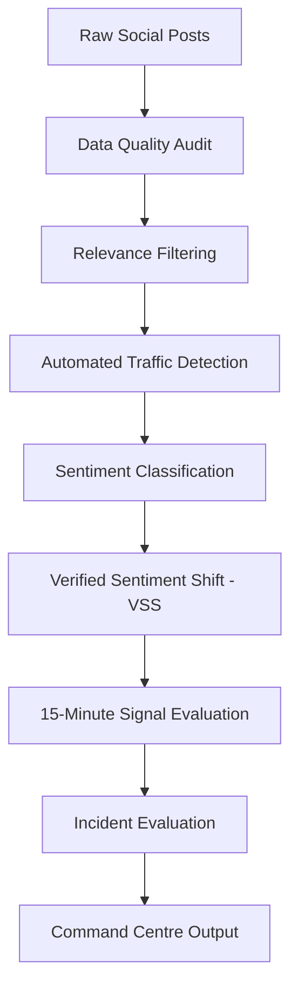

# Forty Minutes Into The Set

## Kestrel Festival — Social-Sentiment Early-Warning System

This project was completed for Tailwyndz Propel Lateral Drive 2026 — Assessment 4.

The assessment asks for a social-listening system for Kestrel Festival that can help a live-event command centre decide which social signals deserve attention and which should be ignored.

## Problem Statement

Kestrel's existing social dashboard relies heavily on post volume and a positive/negative split. The problem is that this creates two opposite risks:

**False alarms:** unrelated conversations, automated traffic and short-lived spikes can make the dashboard appear to show an incident when nothing is wrong.

**Missed incidents:** genuine problems may generate too little social activity, may be expressed neutrally, or may not contain enough usable market information.

The goal of this project was therefore not simply to classify posts as positive or negative. The goal was to build a more trustworthy early-warning layer by:

1. checking and normalising messy incoming data;
2. separating relevant Kestrel/event conversation from ambiguous or unrelated mentions;
3. detecting likely automated traffic;
4. scoring sentiment while handling practical language issues such as negation, sarcasm, emojis and mixed-language text;
5. comparing current sentiment with a meaningful market-specific baseline using Verified Sentiment Shift (VSS);
6. suppressing weak signals and requiring sustained evidence before escalation; and
7. evaluating the resulting signal against the planted incidents in the assessment.

The system is intended as an early-warning layer for human review, not as an autonomous incident-diagnosis system.

## Dataset

The final frozen dataset contains:

- 1,206,715 posts
- 75,000 authors 
- 4 platforms
- 325,831 Kestrel mentions

Mixed timestamp formats, missing fields, late-arriving records and other deliberately injected data-quality problems
14 days of pre-event activity used to establish the VSS baseline
One 14-hour event period containing planted incidents and decoy events

The private ground-truth data is kept separately and excluded from the public repository.

**What the Pipeline Does**



## 1. Data Quality

The analysis first checks whether the raw data can be trusted enough to support downstream calculations.

Key findings:

- 1,206,715 rows;
- 5 timestamp formats;
- 0 unparsed timestamps after normalisation;
- 36,201 late-arriving records;
- 46,863 unmatched author IDs;
- 30.12% missing geography;
- 2,190 exact duplicate event rows;
- 1,171 impossible like values;
- 1,172 extreme reply values;
- 1,172 impossible follower values;

The purpose of this stage is to make data limitations explicit before sentiment or alerting decisions are made.

## 2. Relevance Filtering

The word Kestrel is intentionally ambiguous in the dataset and can refer to unrelated subjects.

Of 325,831 Kestrel mentions:

| Classification | Posts |
|---|---:|
| Confirmed relevant | 119,675 |
| Ambiguous | 120,365 |
| Irrelevant | 85,791 |
| **Total Kestrel mentions** | **325,831** |

Therefore, 206,156 Kestrel mentions (63.3%) were not admitted to the confirmed-relevance VSS set.

This prevents a keyword match from being treated as proof that a post is about the festival.

## 3. Automated Traffic Detection

The final detector identifies likely automated traffic at the post level, using transparent content-based signals including:

- promotional/spam language;
- negative amplification language; 
- and monitoring/summary language.

Evaluation against the private ground truth:

| Metric | Result |
|---|---:|
| True automated posts | 87,868 |
| Predicted automated posts | 85,344 |
| Precision | 97.0% |
| Recall | 94.2% |
| Error rate | 0.632% |

Several alternative approaches were tested and rejected because their false-positive rates were too high. The rejected experiments are documented in approach_tried.md.

## 4. Sentiment

The sentiment layer uses a lightweight rule-based approach covering:

- English
- Hindi/Devanagari
- Hinglish
- Portuguese/German patterns
- emojis
- negation patterns
- selected sarcasm patterns

**Results:**

| Sentiment | Posts |
|----|----:|
|Positive | 203,161 |
|Neutral | 134,520 |
|Negative | 69,546 |

A known limitation is Hindi negation, where some constructions are still misclassified.

## 5. Verified Sentiment Shift (VSS)

VSS asks:

Is sentiment unusually negative for this market compared with its own recent baseline?

The calculation is:

**VSS = (current 15-minute net sentiment) − (14-day pre-event net sentiment for the same market)**

Where:

**net sentiment = % positive − % negative**

Only posts that are:

- classified as human;
- confirmed relevant to Kestrel/the event; and
- associated with a known market
- enter the VSS calculation.

**Decision rules**

< 220 qualifying posts -> NO SIGNAL

VSS ≤ −14 -> **BREACH**

VSS ≤ −14 for 3 consecutive 15-minute windows -> **ESCALATE**

A single breach does not trigger escalation, and raw post volume alone never acts as a sentiment signal.

## VSS Results

Across the event:

**280** 15-minute market windows analysed

**35** breach windows

**20** escalation windows

The planted sponsor-announcement reaction was detected with a 30-minute lead time.

The VSS output is stored in:

`outputs/vss_15min.csv`

**Incident Evaluation**

The final signal was tested against six planted events:

|Incident | Result |
|---|---:|
| Queue crush | Missed |
| Sound failure | Missed |
| Sponsor announcement | Detected — +30 min lead time |
| Payment outage | Missed |
| Positive decoy 1 | Ignored |
| Positive decoy 2 | Ignored |

## Overall:

- 1 / 6 planted incidents detected
- 1 / 4 negative incidents detected
- 0 false escalations on the two positive decoys

The evaluation shows that the system can surface sustained negative social shifts, but it is too selective to function as a standalone incident detector.

The missed incidents also reveal important structural limitations:

1. an incident may not generate enough relevant social activity;
2. a short event may not persist for three consecutive windows;
3. an operational problem may be expressed neutrally;
4. missing market information can prevent market-level scoring.

These are treated as system limitations and plausible failure modes rather than assumed root causes for every individual miss.

## Streamlit Command-Centre Prototype

A lightweight Streamlit interface was added as a presentation layer over the frozen VSS output.

It provides a historical event simulation showing:

1. simulation time;
2. all five markets;
3. market-level VSS;
4. escalation/breach/normal state;
5. qualifying post volume;
6. consecutive breach count; and
7. selected-market investigation details.


The interface does not use a live API or pretend to be a production real-time system. It demonstrates how the analytical outputs could be surfaced to a command centre.

Run it with:

`streamlit run app.py`

## Repository Structure

```text 
Tailwyndz Assignment/
├── app.py
├── data/
│   ├── final/
│   ├── ground_truth/
│   ├── processed/
│   └── raw/
├── docs/
│   └── memo/
│       └── memo.pdf
├── outputs/
│   ├── bot_evaluation.json
│   ├── data_quality_audit.json
│   ├── incident_evaluation.csv
│   ├── relevance_summary.json
│   ├── scored_sample.csv
│   ├── sentiment_summary.json
│   └── vss_15min.csv
├── presentation/
│   └── Tailwyndz PPT.pptx
├── src/
│   ├── analyze_data.py
│   ├── content_bot_test.py
│   ├── coordination_test.py
│   ├── final_generate.py
│   ├── generate_data.py
│   └── signal_test.py
├── tests/
│   └── test_vss.py
├── .gitignore
├── approach_tried.md
├── assumptions.md
├── README.md
└── requirements.txt
```

> **Note:** `data/ground_truth/` contains private evaluation data and is excluded from version control.

Running the Analysis

Create and activate the pinned virtual environment, install the requirements, then run:

`python src/analyze_data.py` - The analysis writes the structured results to `outputs/`.

Run the VSS unit test with: `python -m tests.test_vss`

Run the command-centre demonstration with: `streamlit run app.py`

**Outputs**

The main generated outputs are:

- `data_quality_audit.json` — raw data-quality findings
- `relevance_summary.json` — relevance classification counts
- `bot_evaluation.json` — automated-traffic evaluation
- `sentiment_summary.json` — sentiment totals
- `vss_15min.csv` — 15-minute VSS results
- `incident_evaluation.csv` — planted-incident evaluation
- `scored_sample.csv` — scored sample for inspection

## Documentation

- **approach_tried.md** — approaches that were tested and dropped, with measured reasons

- **assumptions.md** — assumptions made by the analysis and what could break if they are wrong

- **docs/memo/memo.pdf** — two-page recommendation memo

- **presentation/** — final presentation deck

## Key Takeaway

The project is designed around signal discipline:

FILTER → TRUST → COMPARE → ESCALATE

The objective is not to generate more alerts. It is to reduce noisy and weak signals, compare sentiment against an appropriate baseline, require sustained evidence, and make the remaining signals easier for a human command centre to investigate.

## AI Usage

AI tools were used as development assistance during this assessment.

- **ChatGPT** — used for code debugging, identifying implementation issues, suggesting test cases, reviewing analysis logic, and helping structure documentation and presentation/memo content.

- AI assistance was used as a support tool rather than as a substitute for the analysis. Final implementation decisions, thresholds, evaluation methodology, results, assumptions, and interpretations were reviewed against the assessment requirements and the generated dataset.

- No paid AI APIs or proprietary AI services were used in the analysis pipeline.
